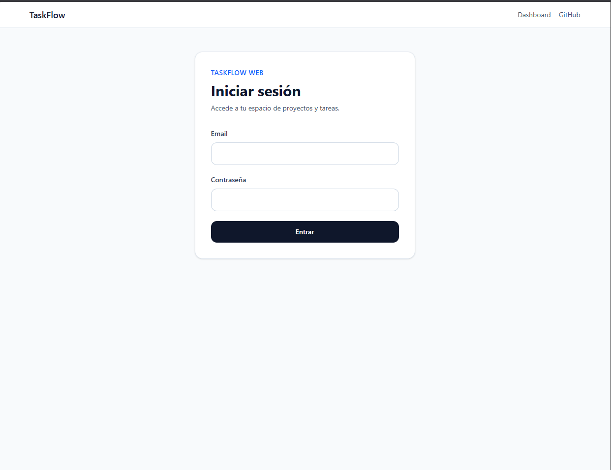
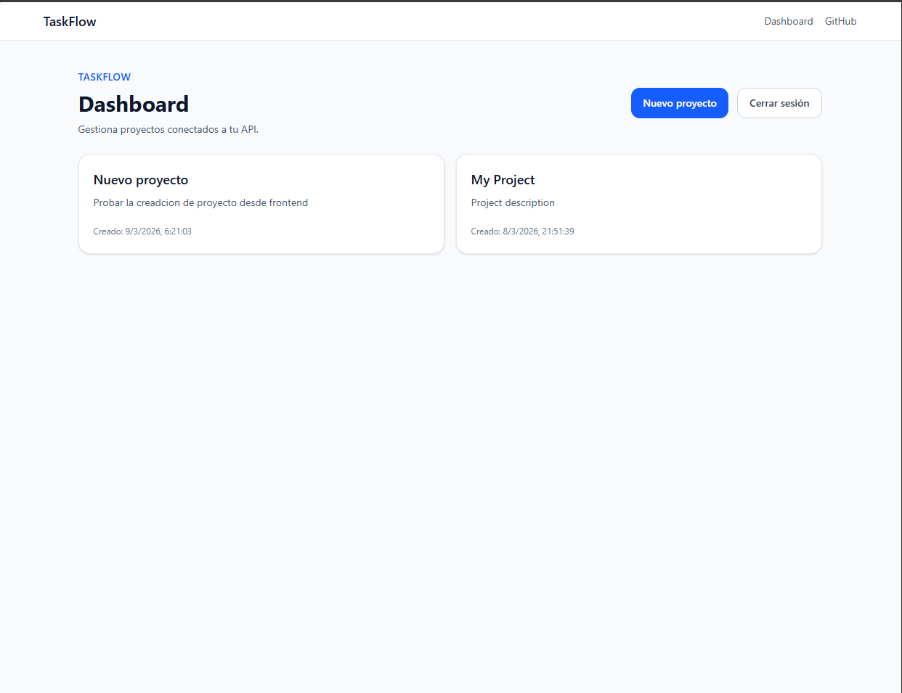
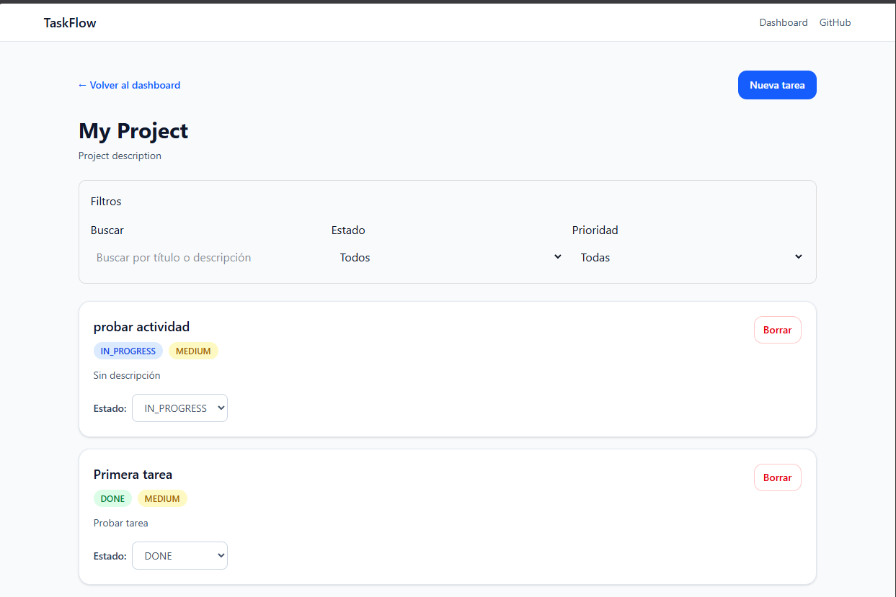
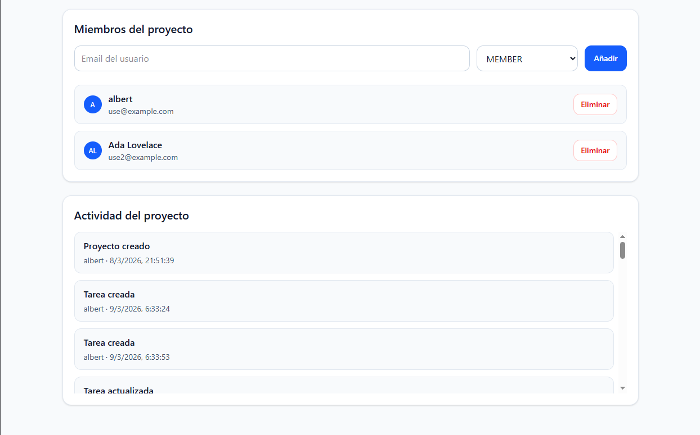
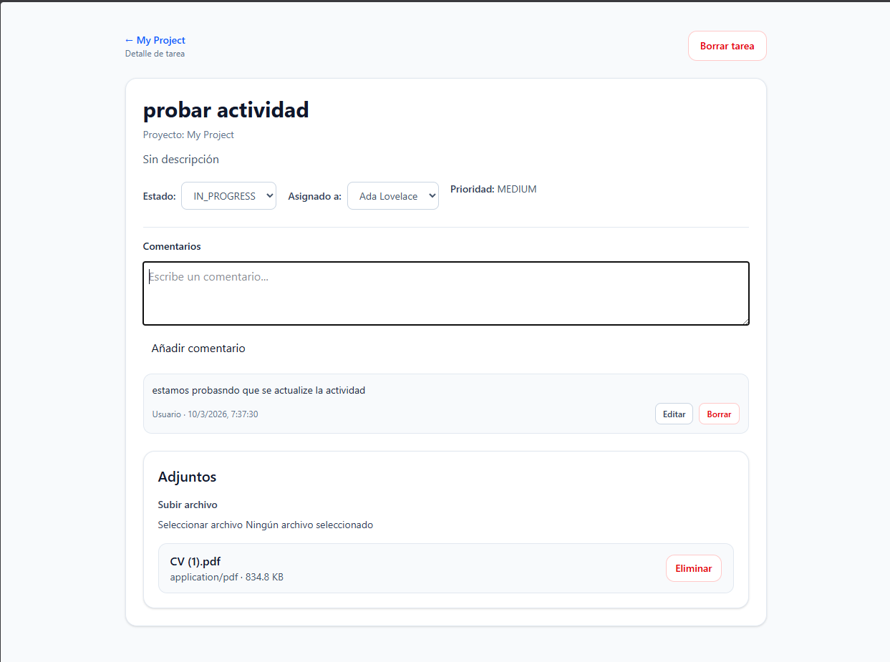

# TaskFlow Web

Frontend de **TaskFlow**, una aplicación de gestión de proyectos y tareas construida con **React**, **TypeScript** y **Vite**.

Consume la API de `taskflow-api` y ofrece una interfaz moderna para autenticación, proyectos, tareas, comentarios, adjuntos, miembros, actividad y asignación de usuarios.

---

## Demo funcional

### Login


### Dashboard


### Project Detail


### Project Detail


### Task Detail


---

## Funcionalidades

- Autenticación con JWT
- Rutas protegidas
- Dashboard de proyectos
- Crear proyectos
- Gestión de miembros del proyecto
- Crear tareas
- Editar estado de tareas
- Eliminar tareas
- Filtrar tareas por estado, prioridad y búsqueda
- Asignar tareas a miembros del proyecto
- Comentarios en tareas
- Editar y borrar comentarios
- Adjuntos en tareas
- Timeline de actividad del proyecto
- Configuración mediante variables de entorno

---

## Stack tecnológico

### Frontend
- React
- TypeScript
- Vite

### Estado y datos
- TanStack Query
- Axios

### Estilos
- Tailwind CSS

### Routing
- React Router

---

## Arquitectura

```txt
src/
 ├── api/
 ├── app/
 ├── components/
 ├── features/
 │    ├── projects
 │    ├── tasks
 │    ├── comments
 │    └── activity
 ├── layouts/
 ├── pages/
 ├── routes/
 └── main.tsx
```

---

## Relación con el backend

Este frontend consume la API del proyecto:

`taskflow-api`

Repositorio:

`https://github.com/albertiacob91/taskflow-api`

---

## Variables de entorno

Crear archivo `.env.local`:

```env
VITE_API_BASE_URL=http://localhost:3000
```

---

## Instalación

```bash
git clone https://github.com/albertiacob91/taskflow-web.git
cd taskflow-web
npm install
```

---

## Desarrollo

```bash
npm run dev
```

Aplicación disponible en:

`http://localhost:5173`

---

## Build

```bash
npm run build
```

---

## Estado del proyecto

Versión actual: `v0.21.0`

Proyecto orientado a portfolio profesional full-stack.

---

## Autor

Albert Luis Iacob Istrati  
`https://github.com/albertiacob91`
